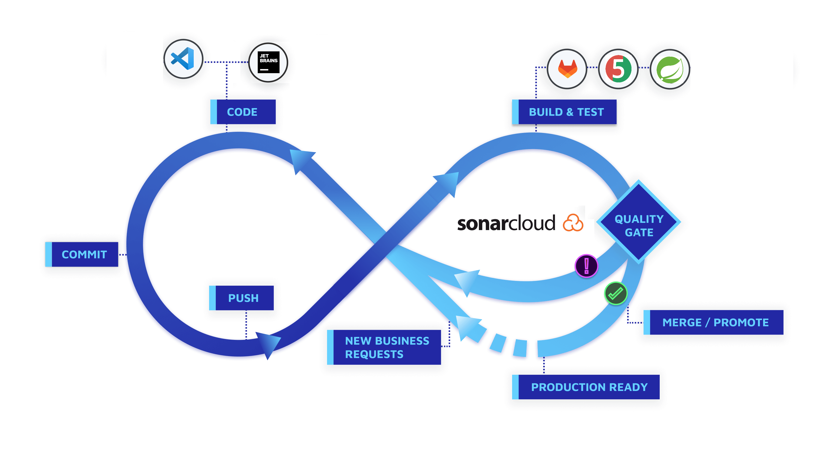

# EasyDefence

## Overview
Il progetto EasyDefence permette di utilizzare una suite di strumenti in ambito security, in particolare di BlueTeam, ovvero di difesa.
Tra le varie funzionalità messe a disposizione da questa applicazione web, alcune permettono di effettuare ricerche sia riguardo numeri spam che ci potrebbero contattare svariate volte ma anche domini potenzialmente fraudolenti trovati nelle mail di phishing.
È possibile verificare quanto il nostro dispositivo con cui ci interfacciamo sull’applicazione web sia esposto ad eventuali minacce.

## Requisiti funzionali

Di seguito si elencano i requisiti funzionali ad alto livello, che EasyDefence offre:

- **Rischi del device e CVE**
  - L'utente, tramite l'homepage, ha la possibilità di verificare se il dispositivo e il relativo software (sistema operativo e la sua versione) con cui accede sia vulnerabile. Ha accesso ad un grafico che mostra la media delle severity di sicurezza a cui il dispositivo è associato. E' possibile inoltre visualizzare le prime venti CVE al di sotto del grafico, ad ogni CVE è attribuito un colore in base al punteggio di severity, da verde a rosso, in base al punteggio della gravità.
- **File-Checker**
  - L'utente ha disposizione una sezione per verificare che un file, tramite upload dello stesso, sia affetto da malwares o virus, in modo da poter verificare velocemente la sicurezza di un file ricevuto senza l'utilizzo di antivirus. In caso di file anomalo (segnalato dai top vendor antimalwares) sarà possibile consultare alcuni dati riguardo i tags di distribuzione del file stesso e altre informazioni riguardo sulla maliziosità del file.
- **Password-Generator**
  - L'utente può generare una password efficace in modo randomico a partire da una lunghezza desiderata, in più può comodamente copiarla tramite un pulsante e quindi utilizzarla come meglio preferisce per proteggere i suoi account. Inoltre è possibile rendere la password ancora più sicura includendo numeri e caratteri speciali.
- **Who-is-Domain**
  - L'utente può ottenere informazioni riguardo il whois di un dato dominio. Le informazioni riguardano Server di registrazione del dominio, amministratori registrati e altri dati.
- **URL-Checker**
  - L'utente può ricercare informazioni, quali distribuzioni, tags e statistiche, su un dato URL. In generale, le informazioni permettono di ottenere una panoramica per quanto concerne l'affidabilità del sito inserito.
- **PhoneNumber-Checker**
  - L'utente può ottenere informazioni su un dato numero di telefono, attraverso l'inserimento del suo prefisso nazionale e del numero stesso. Inoltre, è possibile ottenere un grado di attendibilità del numero.

## Strumenti e tecnologie utilizzate


L'applicazione è stata sviluppata su due componenti diverse: frontend e backend. L'utente si interfaccia con la componente frontend, che è stata sviluppata utilizzando HTML e CSS per quanto riguarda 
la struttura delle pagine, ma in generale per definire l'estetica di esse, e Thymeleaf per recuperare i dati dalla componente backend e permetterne la visualizzazione.
La componente backend si basa sul framework Spring Boot (Java), che è stato utilizzato per ottenere dati da servizi (API) esterni, manipolarli nel layer di business logic e restituirli attraverso la definizione 
di vari endpoint (controller).
### Struttura dell'architettura

Dal punto di vista architetturale si è deciso di utilizzare il pattern
**MVC (Model - View - Controller):**, uno dei più utilizzati per l’implementazione di web applications. <br>
Il main core di questo pattern è di separare la logica di data visualization dalla logica di business, 
così da consentire ai componenti model dell’applicazione di essere modificati senza alterare le controparti relative di visualizzazione.
<br>Il package **Client** contiene delle interfacce che sfruttano FeignClient per effettuare delle richieste HTTP ai servizi esterni, il package **Service** contiene le classi Wrapper per le chiamate
contenute nel package client, il package **Controller** contiene le classi che definiscono gli endpoint e contengono la logica di business dell'applicazione nella quale vengono coinvolte le classi
Service.<br>
Il package **Exception** contiene le classi che definiscono le eccezioni da poter lanciare in caso di errore. Il package **mapper** contiene le classi che effettuano il mapping tra le response dei 
servizi esterni e i DTO dell'applicazione. <br>
Il package **Model** contiene le entità dei servizi esterni e i DTO interni all'applicazione.<br>
Il package **Utils** contiene delle classi per salvare valori costanti e Mock.

## Branching strategy
Per quanto riguarda la branching strategy, si è deciso di implementare un branch per ogni *user story* definite nella bacheca Trello, un branch per raccogliere le features sviluppate durante lo
Sprint 1 e lo Sprint 2 e un branch main per raccogliere l'applicazione al completo.
<div align="center">

</div>

## Pipeline, Quality Gate e Test

Abbiamo deciso di implementare una pipeline su **Gitlab** che prevede i seguenti steps:
1. esecuzione di test unitari: sono stati sviluppati dei test sfruttando il framework **JUnit**
2. esecuzione di test di integrazione: sono stati sviluppati dei test sfruttando **MockMVC** che utilizzano l'applicazione in maniera reale.
3. SonarQube: dopo l'esecuzione dei tests, il codice viene analizzato da SonaQube e un Quality Gate da noi definito, il quale prevede: 
   - coverage almeno 75% 
   - 0 issues 
   - Linee duplicate < 10%
   - rating classe A
4. Pages: l'ultimo step prevede che la javadoc generata venga deployata sulle gitlab pages. La documentazione tecnica è infatti sempre disponibile a questo link: [documentazione](https://easydefence-easydefence-b2c643a008c3d6b3a32fb186a090ee65dc1c876.gitlab.io)
   

Abbiamo implementato 95 unit test, 21 integration tests e 11 tests di sistema sfruttando Selenium. --> **127 tests totali**. <br>
L'analisi di qualità del codice, ad ogni lancio della pipeline, viene resa disponibile al seguente link
[SonarCloud](https://easydefence-easydefence-b2c643a008c3d6b3a32fb186a090ee65dc1c876.gitlab.io)



## Servizi esterni

Il nostro sistema fa uso di servizi esterni per migliorare e arricchire le funzionalità offerte dall'applicazione.
Attualmente, sfruttiamo due servizi forniti da NinjaAPI, due dal Nist, uno da UserStack e due da RapidAPI.
Di seguito elenchiamo i nomi degli API con relativo endpoint, parametri richiesti e un esempio di risposta.

### NinjaApi
### 1. Servizio `validatephone`

Il servizio `validatephone` consente di convalidare i numeri di telefono inseriti dagli utenti.
Questo servizio verifica la validità e la correttezza dei numeri di telefono forniti.

### UserStack - Rilevamento delle Informazioni Utente

Il sistema integra il servizio esterno UserStack API per ottenere informazioni dettagliate sull'agent, come il tipo di dispositivo, 
il sistema operativo e il browser utilizzati dagli utenti che interagiscono con la nostra applicazione.

### RapidAPI

### 1. Servizio `Random Password Generator`

Il servizio `Random Password Generator` permette di generare una password randomiche sicure, inserendo come parametro una lunghezza e inoltre
fornisce la possibilità di poter specificare se si desidera ottenere una password con caratteri speciali e/o numeri.

### 2. Servizio `Who Is Lookup`

Il servizio `Who Is Lookup` permette di verificare una serie di informazioni riguardo la registrazione di un dato dominio.

### 3. Servizio `Get hash from File`

Il servizio `Get hash from File` permette di ottenere l'hash in formato sha256 inserendo un file come parametro, al fine di verificare successivamente 
se questo risulta malevolo ai diversi vendors.


### NIST National Vulnerability Database (NVD) API - Recupero delle Vulnerabilità

Il nostro sistema integra il servizio esterno NIST National Vulnerability Database (NVD) API 
per ottenere informazioni sulle vulnerabilità di sicurezza. Questo servizio consente di accedere a 
 informazioni dettagliate sulle Common Vulnerabilities and Exposures (CVE) e fornisce un'ampia gamma di dati relativi alle vulnerabilità di sicurezza notificate.

### 1. Servizio `Get CVE`

Il servizio NIST NVD API offre la possibilità di recuperare informazioni sulle vulnerabilità inserendo dei parametri di ricerca come lo user agent.

### VirusTotal

### 1. Servizio `Get a domain report`

Il servizio `Get a domain report` permette di ottenere informazioni su un dato URL in base ai top vendor antimalwares.

### 2. Servizio `Get a summary of all MITRE ATT&CK techniques observed in a file`

Il servizio `Get a summary of all MITRE ATT&CK techniques observed in a file` permette di ottenere informazioni su tattiche MITRE e le relative tecniche di attacco di un file caricato.


## Prerequisiti

### Download e installazione di JDK11

Per poter eseguire l'applicazione, è necessario scaricare e installare una JDK a partire dalla versione 11.

[JDK11](https://www.oracle.com/it/java/technologies/javase/jdk11-archive-downloads.html)

E' consigliabile anche impostare la variabile di ambiente PATH con la directory "bin" della JDK installata, in modo tale
da poter eseguire Java da qualsiasi directory del dispositivo utilizzato.

## Test

Prima di eseguire l'applicazione, è consigliabile lanciare unit tests e tests di integrazione digitando il comando:
```bash
mvn clean install -PskipSystemTests
```

Oltre a questi test, è possibile lanciare i test di sistema eseguiti tramite il tool Selenium.

Prima di effettuare questi test, è necessario avviare l'applicazione seguendo le istruzioni contenute nella prossima sezione *"Avvio dell'applicazione"*
o nella sezione *"Avvio alternativo dell'applicazione"*.

Una volta lanciata, è possibile eseguire i test di sistema utilizzando il comando:

```bash
mvn clean install -PsystemTests
```

## Avvio dell'applicazione

### Effettuare il package
```bash
mvn clean install -PskipSystemTests
```
### Lanciare l'applicazione
```bash
java -jar target/easydefence.jar
```
L'applicazione sarà disponibile al seguente indirizzo: [http://localhost:8080/](http://localhost:8080/).

## Avvio alternativo dell'applicazione

I seguenti passaggi sono stati eseguiti utilizzando l'IDE IntelliJ IDEA.
Utilizzando altri IDE, il seguente processo di esecuzione potrebbe differire leggermente.

* Aprire l’IDE
* Selezionare File > New > Project from Version Control e inserire il seguente link: [https://gitlab.com/easydefence/easydefence.git](https://gitlab.com/easydefence/easydefence.git)
* Nella finestra Project sulla sinistra, aprire il progetto 'easydefence' > src > main > java > it.unimib.easydefence
* Cliccare con il tasto destro sulla classe 'EasydefenceApplication'
* Cliccare su Run 'EasydefenceApplication'
* Aprire un Browser (durante lo sviluppo è stato utilizzato Chrome)
* Digitare nella barra degli indirizzi [http://localhost:8080/](http://localhost:8080/) per entrare nell’applicazione web

## Documentazione

A [questo link](https://gitlab.com/easydefence/easydefence/-/wikis/Documentation) è possibile consultare la documentazione del progetto.

## Autori
Luca Loddo 844529

Riccardo Moschi 856243

Alessio Mognato 844953
